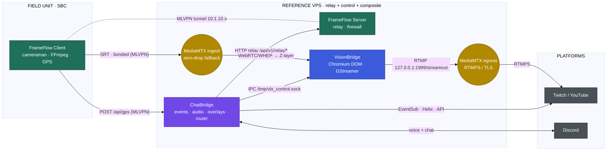

# Architecture — VLX VisionBridge

> **Part of the VLX Stream Flow ecosystem — Composition tier.**
> This document details VisionBridge's internal design and its contracts with the sibling services **VLX FrameFlow** and **VLX ChatBridge**.

VLX VisionBridge is a headless, high-performance Go service — a remote, headless OBS Studio for VMs. It uses a **DOM-dominant architecture**: all media rendering happens in the Chromium DOM, while GStreamer is a passive screen recorder (`ximagesrc` on Xvfb `:99` + `pulsesrc`) that pushes the composited output to a local MediaMTX.

---

## The VLX Stream Flow ecosystem

VLX Stream Flow is a self-hosted, end-to-end broadcasting stack composed of three cooperating services:

| Project | Tier | Responsibility | |
| :--- | :--- | :--- | :--- |
| **VLX FrameFlow** | Edge & Transport | Bonded uplink (MLVPN + MPTCP), SBC multi-camera SRT encode, GPS telemetry, VPS relay | |
| **VLX VisionBridge** | Composition | Headless Chromium-DOM scene compositor + GStreamer capture → MediaMTX restream | **← this repository** |
| **VLX ChatBridge** | Control & Engagement | Twitch/YouTube events, Discord audio gateway, overlays, and the ecosystem command router | |



### Reference topology

The reference deployment is a **single VPS** that co-hosts the FrameFlow Server, ChatBridge, and VisionBridge (each with its MediaMTX role), reachable from the SBC over the MLVPN tunnel (`10.1.10.x`). Components may be split across hosts; the contracts below are host-agnostic.

---

## VLX Stream Flow contracts

> These four contracts are **normative for the whole ecosystem** and are reproduced verbatim in each project's `ARCHITECTURE.md`. Change them in lockstep across all three repositories.

### Canonical port & endpoint map

| Service | Component | Bind (default) | Purpose |
| :--- | :--- | :--- | :--- |
| FrameFlow | Client API (Gin) | `9090` | `/api/<module>/…` on the SBC |
| FrameFlow | Server relay | `127.0.0.1:9090` | `/api/v1/relay/*`, `/api/v1/peer/:id/*` |
| FrameFlow | Frontend (Svelte) | `8080` | Control panel + telemetry WS `/ws` |
| FrameFlow | MediaMTX ingest | SRT `8890` · RTMP `1935` · RTMPS `1936` · WebRTC `8889` · API `127.0.0.1:9997` | `cameraman` / `wificam` paths |
| FrameFlow | gpsd | `1198` | local GPS daemon |
| ChatBridge | Server (overlays + GPS ingest) | `8000` (test `8001`) | overlays, `POST /api/gps` |
| ChatBridge | Control API | `127.0.0.1:8760` | management REST + console WS |
| ChatBridge | Frontend (Svelte) | `8090` | GUI → control API |
| ChatBridge | Connector | `/tmp/vlx_control.sock` | IPC **writer** → VisionBridge |
| VisionBridge | Control API | `127.0.0.1:8770` | management REST + console WS |
| VisionBridge | Frontend (Svelte) | `8091` | GUI → control API |
| VisionBridge | Overlay/WS server | `50051` (WebRTC `50000–50050`) | Chromium DOM sync |
| VisionBridge | Connector | `/tmp/vlx_control.sock` | IPC **listener** ← ChatBridge |
| VisionBridge | MediaMTX egress | RTMP `1999` · RTMPS `1936` · SRT `8890` | `streamout` restream |

> ⚠️ **Co-location deconfliction:** on the single-VPS reference topology the FrameFlow ingest MediaMTX and the VisionBridge egress MediaMTX **both** default to RTMPS `1936` and SRT `8890`. Assign distinct ports per instance (e.g. move VisionBridge's MediaMTX RTMPS to `1937` / SRT to `8891`) before running them on the same host.

### 1. Connector (IPC) contract — ChatBridge → VisionBridge

Transport: **newline-delimited JSON over a Unix domain socket** (`/tmp/vlx_control.sock`). ChatBridge is the writer (`connector.ipc_control_out`); VisionBridge is the listener (`connector.ipc_control_in`).

Envelope:

```json
{ "event_id": "uuid", "timestamp": 1700000000, "action": "…", "target": "…", "payload": { "enabled": true, "text": "…" } }
```

| `action` | `target` | `payload` | Effect on VisionBridge |
| :--- | :--- | :--- | :--- |
| `set_input_state` | `stream` | `{enabled}` | Enable/disable output; disabling SIGKILLs FFmpeg. |
| `set_input_state` | `overlay@layerN` | `{enabled, text=path}` | Toggle Z-layer *N*; set its path when enabling. |
| `set_input_state` | `volume@layerN` | `{text="0..100"}` | Set Z-layer *N* volume (live, no restart). |
| `reload` | `chromium` | `{}` | Restart the Chromium DOM engine. |
| `apply_template` | — | `{text=template_filename}` | Apply a stored Z-layout template. |

### 2. Command / webhook contract — ChatBridge → FrameFlow

ChatBridge reaches the SBC through the FrameFlow **Server relay**, never the SBC API directly:

```
POST http://127.0.0.1:9090/api/v1/relay/<path>      →  MLVPN  →  SBC /api/<path>
```

Valid `<path>` verbs (Client API): `frameflow/client/{start,stop,status,reset}`, `frameflow/ap/{start,stop,status}`, `frameflow/bonding/{start,stop,status}`, `cameraman/{start,stop,status,list-dev}`, `mediamtx/{start,stop,status}`, `gps/{start,stop,status}`. Example: `POST /api/v1/relay/cameraman/start` with `{"device":"V0A1"}`.

### 3. GPS telemetry contract — FrameFlow → ChatBridge

The SBC GPS sender POSTs, at ~1 msg / 5 s, to `gps_target_url` (the ChatBridge `POST /api/gps` receiver, typically `http://10.1.10.1:8000/api/gps` over MLVPN). Body:

```json
{ "lat": 0.0, "lon": 0.0, "alt": 0.0, "pos_error": 0.0, "speed": 0.0 }
```

ChatBridge re-wraps this as `{"type": "<overlay.gps.event_type|gps>", "data": {…}}` and broadcasts it over WebSocket to `gps_overlay.html` (which also accepts the legacy type `gps_update`) at 60 fps. The endpoint is unauthenticated by design; Layer-3 MLVPN isolation secures it.

### 4. Media-path contract — FrameFlow → VisionBridge

SBC cameras → FrameFlow Client FFmpeg **SRT (bonded, MLVPN)** → FrameFlow Server **MediaMTX** (`cameraman`/`wificam`, SRT `8890`, zero-drop `/offline` fallback) → VisionBridge consumes the feed as a **Chromium Z-layer** (a WebRTC/WHEP or iframe URL pointing at the ingest MediaMTX) → VisionBridge composites and restreams onward.

---

## Project structure

- `internal/models` — core structs (`Layer`, `Config`, `DatabaseConfig`).
- `configs` — `visionbridge.settings.template` embedded via `configs/assets.go` for self-contained installs.
- `internal/config` — YAML parsing, config watching, and diffing.
- `internal/db` — SQLite connection pool (`github.com/mattn/go-sqlite3`) + logging.
- `internal/engine` — GStreamer pipeline generator and process manager, decoupled into `source` (input parsing / path sanitisation), `mixer` (pipeline construction), and `streamer` (multi-destination output). The connector listener lives here (`internal/engine/connector.go`).
- `internal/controlapi` — always-on management REST + console WS.
- `internal/ui` — embedded Svelte SPA served by the frontend binary.

## Configuration & hot-reloading

The service is fully configured via `visionbridge.settings` (default `/opt/VLX_VisionBridge/etc/visionbridge.settings`; overridable by `CONFIG_PATH` or a positional argument). A `Config Watcher` (`fsnotify`) monitors the file, and a diffing step selects the action:

- **RequiresFilterUpdate** — layout property changes (X, Y, volume) follow the SSOT pattern (YAML write → watcher → WebSocket broadcast) for zero-CPU DOM manipulation.
- **RequiresRestart** — structural changes (`resolution`, `active`, `destinations`) trigger a full GStreamer restart.

## Input pipeline — HTML overlays (`chromium_source`)

A Chromium process runs non-headless inside an Xvfb display and renders up to **13 Z-layers** (`Z0`–`Z12`):

- All media renders in the DOM; VisionBridge generates `<video autoplay loop>`, ``, or `<iframe>` tags based on the path's inferred content type.
- Directory-based playback uses the Go endpoint `/api/list-dir?path=…`, which the Chromium WebSocket client fetches to sequence/loop media as a carousel without GStreamer involvement.
- `BgColor` (from `InputSettings`) is injected into the generated HTML; absolute positioning is applied via inline CSS to eliminate browser offsets.

## VLX Connector (IPC integration)

VisionBridge listens on the Unix control socket for inbound `ControlCommand` messages (see the [Connector contract](#1-connector-ipc-contract--chatbridge--visionbridge)). Incoming commands follow the SSOT pattern; `set_input_state`/`volume@layer`/`apply_template`/`reload` are handled by `handleControlCommand`. For performance-sensitive filter generation, `strings.Builder` and stack buffers are preferred over `fmt.Sprintf`.

## Engine, mixer & output

GStreamer captures the Xvfb canvas (`ximagesrc` + `pulsesrc`). The base canvas is `cfg.Input.Resolution`; the final scaled output is `cfg.Output.Resolution` (changes to input resolution require a restart; layer position/size changes may not). The output layer encodes to H.264/AAC and pushes to the **local egress MediaMTX** at `rtmp://127.0.0.1:1999/streamout`. A `tee` muxer clones simultaneous outputs, and automatic codec enforcement prevents conversion failures when mixing media types or dummy streams.

**External routing & TLS** are delegated to the local MediaMTX via its **static configuration** (`destinations` + RTMPS certificate settings), optionally combined with MediaMTX's own `runOnReady`/`runOnPublish` hooks. VisionBridge itself makes no outbound control calls to other VLX services.

## Resilience & process management

A `ProcessManager` governs the GStreamer subprocess:

- **Idle behaviour** — when output is deactivated (config or IPC), GStreamer stays fully dormant (0% CPU) until a `set_input_state` / `target=stream` / `enabled=true` command wakes it.
- **Health monitor** — tracks CPU/RAM and stream stability, logging metrics to SQLite.
- **Error diagnostics** — a 4096-byte `tailBuffer` of stderr classifies failures as `[input]`, `[mixer]`, or `[output]`.
- **RetryTracker** — backoff (5 quick, 2 slow, then dynamic disablement) to isolate failing sources.
- Process reaping and signal listeners prevent zombies after graceful or ungraceful shutdown.

## Persistence & logging

SQLite (default `/opt/VLX_VisionBridge/var/visionbridge.db`) stores reusable source templates, layout presets, and broadcast logs (uptime, bitrate fluctuations, error states).

## Control API & Web GUI

The `ControlAPI` is always-on and independent of the hot-swappable engine: Basic-Auth REST (`bind_address`, `port` default `8770`) plus an on-demand `journalctl` console over WebSocket (spawned per connection, tied to the socket lifecycle, authorised via short-lived tickets). The optional `frontend` binary embeds a Svelte 5 SPA and reverse-proxies to the control API (`frontend.settings`, GUI on `8091`).

## Security

- Non-root execution is enforced (except during installation).
- `SanitizeInputPath` prevents argument injection (paths starting with `-` are prefixed with `./`).
- Strict integer typing for overlay properties (Width, Height, X, Y) prevents filter injection.

---

<sub>VLX VisionBridge is part of the **VLX Stream Flow** ecosystem · [FrameFlow](https://github.com/viruslox/VLX_FrameFlow) · [VisionBridge](https://github.com/viruslox/VLX_VisionBridge) · [ChatBridge](https://github.com/viruslox/VLX_ChatBridge)</sub>
