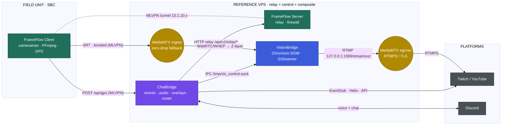

# VLX VisionBridge

> **Part of the [VLX Stream Flow](#the-vlx-stream-flow-ecosystem) ecosystem — the Composition tier.**
> A headless, high-performance Chromium-DOM scene compositor with a GStreamer capture core — "headless OBS" for remote VMs.

VLX VisionBridge is a headless Linux service written in Go. It uses a **DOM-dominant architecture**: all media rendering (videos, images, carousels, overlays) happens in the **Chromium DOM**, and **GStreamer** acts purely as a passive screen recorder — a static pipeline with `ximagesrc` (capturing the Xvfb display `:99`) and `pulsesrc` — that pushes the composited output to a local MediaMTX. Complex JS screen-capturing and dynamic GStreamer source switching are deliberately avoided.

Built for professional 24/7 broadcasting where configuration must be dynamic and resource use minimal. For the full system design, see **[ARCHITECTURE.md](ARCHITECTURE.md)**.

---

## The VLX Stream Flow ecosystem

VLX VisionBridge is one of three cooperating services in the **VLX Stream Flow** ecosystem — an end-to-end, self-hosted stack for IRL and studio broadcasting that runs from the field camera all the way to the streaming platform.

| Project | Tier | Responsibility | |
| :--- | :--- | :--- | :--- |
| **[VLX FrameFlow](https://github.com/viruslox/VLX_FrameFlow)** | Edge & Transport | Bonded uplink (MLVPN + MPTCP), SBC multi-camera SRT encode, GPS telemetry, VPS relay | |
| **[VLX VisionBridge](https://github.com/viruslox/VLX_VisionBridge)** | Composition | Headless Chromium-DOM scene compositor + GStreamer capture → MediaMTX restream | **← this repository** |
| **[VLX ChatBridge](https://github.com/viruslox/VLX_ChatBridge)** | Control & Engagement | Twitch/YouTube events, Discord audio gateway, overlays, and the ecosystem command router | |



**VisionBridge's role in the ecosystem:** VisionBridge is the compositor. It renders the FrameFlow camera feed (consumed as a Chromium **Z-layer** from the ingest MediaMTX) together with overlays and media into a single 24/7 scene, then screen-captures that scene with GStreamer and pushes it to its **local egress MediaMTX** (`rtmp://127.0.0.1:1999/streamout`), which restreams over RTMPS/TLS to Twitch. Live scene control (show/hide layers, volumes, templates, wake/sleep the stream) arrives over the **VLX Connector** IPC socket from ChatBridge. The canonical inter-service contracts are specified in **[ARCHITECTURE.md → VLX Stream Flow contracts](ARCHITECTURE.md#vlx-stream-flow-contracts)**.

---

## How it works

VisionBridge is a Cloud-Native "sidecar" compositor built on three pillars:

1. **DOM-dominant rendering** — all media renders in the Chromium DOM across up to **13 Z-layers** (`Z0`–`Z12`).
2. **GStreamer capture core** — a static pipeline (`ximagesrc` on Xvfb `:99` + `pulsesrc`) records the composited canvas.
3. **Local MediaMTX sidecar** — GStreamer muxes and pushes the output unencrypted to a **local** MediaMTX (`rtmp://127.0.0.1:1999/streamout`). All external routing, RTMPS and TLS resilience are delegated to that local MediaMTX via its **static configuration** (destinations + certificate settings), keeping the compositor itself simple and low-latency.

> **Note:** external routing/TLS is configured statically in the bundled MediaMTX template (and, optionally, MediaMTX's own `runOnReady`/`runOnPublish` hooks). VisionBridge does not depend on any other VLX service to reach its destinations.

## Requirements

- **Hardware:** multi-core CPU for GStreamer, adequate RAM for media buffering.
- **Software:** modern Linux (e.g. Ubuntu 22.04), GStreamer 1.0 (good/bad/ugly + libav), Chromium, `pion/webrtc`.
- **Network:** high-bandwidth, low-latency link for SRT/WebRTC ingest and simultaneous output.

```bash
apt-get install gstreamer1.0-tools gstreamer1.0-plugins-base gstreamer1.0-plugins-good \
                gstreamer1.0-plugins-bad gstreamer1.0-plugins-ugly gstreamer1.0-libav
```

## Core principles

- **DOM-dominant** — media renders exclusively in the Chromium DOM; GStreamer only records.
- **Headless first** — managed entirely via config files / DB entries.
- **Dynamic reconfiguration** — hot-reload layouts and sources without dropping the output (where technically possible).
- **Resource optimisation** — sources marked `OFF` are excluded from the pipeline entirely.
- **Multi-destination** — single encode pass with multiple `tee` output clones.

## Layer control rules

- **SSOT pattern** — inbound JSON control commands update the YAML settings file directly; the file watcher then broadcasts over WebSocket to the Chromium clients for zero-CPU DOM manipulation.
- **Keep `chromium_source` active** — Z-layers must stay `active: true`; show/hide is done via WebSocket/JS to avoid stream drops. Setting the **output** stream to `Enabled: false` terminates the encoder to halt broadcast.

```yaml
input:
  resolution: "1920x1080"
  chromium_source:
    active: true
    z1_active: true
    z1_path: "/opt/VLX_VisionBridge/media/layer1.mp4"
    z1_volume: 100
    z1_width: 1920
    z1_height: 1080
    z1_x: 0
    z1_y: 0
```

---

## Configuration reference

VisionBridge is configured via a YAML settings file with five primary sections: `database`, `connector`, `output`, `input`, and `control_api`.

### `database`
- `dsn` — path to the SQLite database file.

### `connector`
- `ipc_control_in` — enable the inbound IPC control listener (**VisionBridge is the listener**; ChatBridge is the writer).
- `group` — user group owning the control socket.
- `control_socket` — Unix domain socket path (default `/tmp/vlx_control.sock`).

### `output`
- `active` — toggle streaming output.
- `resolution` — final scaled output resolution.
- `fps`, `video_bitrate`, `audio_bitrate`, `audio_sample_rate` — encode parameters.
- `destinations` — array of output URIs (default `rtmp://127.0.0.1:1999/streamout` → local MediaMTX).

### `input`
- `bg_color`, `resolution` (master canvas), `framerate`.
- `carousel_delay`, `carousel_shuffle` — directory-playback behaviour.
- `webrtc_port_min` / `webrtc_port_max` — inbound WebRTC UDP range (default `50000–50050`).
- `overlay_server_active` / `overlay_server_port` — internal Web/WebSocket server (default `50051`).
- `media_folder_path` — base media directory.
- `chromium_source` — up to 13 DOM Z-layers (`Z0`–`Z12`), each with `z*_active`, `z*_path`, `z*_volume`, `z*_width`, `z*_height`, `z*_x`, `z*_y`.

### `control_api`
- `enable`, `bind_address`, `port` (default `8770`), `user`, `pass`, `log_unit`.

### Frontend (`frontend.settings`)
- `bind_address` / `bind_port` (default `8091`) — GUI web server.
- `VB_GUI_USER` / `VB_GUI_PASS` — GUI Basic Auth.
- `backend_address` / `backend_port` / `backend_user` / `backend_pass` — must match the `control_api` block.

---

## Reverse proxy (Apache)

```apache
# ===== VisionBridge GUI  (frontend :<port> — console WS at /api/console/ws) =====
RedirectMatch ^/visionbridge$  /visionbridge/
ProxyPass        /visionbridge/api/console/ws ws://127.0.0.1:<port>/api/console/ws
ProxyPass        /visionbridge/               http://127.0.0.1:<port>/
ProxyPassReverse /visionbridge/               http://127.0.0.1:<port>/
```

## Consuming the FrameFlow feed

Point a Z-layer at the FrameFlow **ingest** MediaMTX WebRTC/WHEP (or iframe) URL for the SBC path (e.g. `cameraman`). VisionBridge treats it like any other DOM layer, so the camera can be shown, hidden, resized, or volume-mixed live via the connector.

## Automatic "Be Right Back"

Hook MediaMTX `runOnPublish` / `runOnUnpublish` scripts to inject JSON into VisionBridge's control socket, producing an automatic fallback/BRB screen on signal loss.

---

## License

**GNU General Public License v3.0** — see [LICENSE](LICENSE).

---

<sub>VLX VisionBridge is part of the **VLX Stream Flow** ecosystem · [FrameFlow](https://github.com/viruslox/VLX_FrameFlow) · [VisionBridge](https://github.com/viruslox/VLX_VisionBridge) · [ChatBridge](https://github.com/viruslox/VLX_ChatBridge)</sub>
